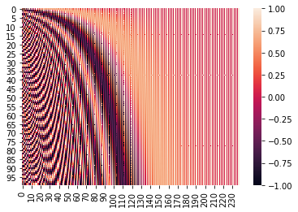

# Positional Encodingについて

# はじめに

BERTやXLNetで用いられているTransformerを理解しようとAttention Is All You Needを読んでいました。Attention周りの説明はわかりやすく書かれていたのですが単語の分散表現に位置情報を与えるPositional Encodingの部分の説明が少なく、理解できなかったので別途調査しました。

# Positional Encodingとは

Positional Encodingとは2017年に発表されたTransfomerと呼ばれるアーキテクチャに組み込まれている単語の位置情報を機械学習モデルに組み込むための仕組みです。結論から述べると、下記の式で求められます。ここで$pos$は単語の出現位置、$i$は次元位置、$d$は分散表現の次元数です。

$$PE(pos, 2i) = sin(pos/10000^{2i/d_{model}})\\
PE(pos, 2i+1) = sin(pos/10000^{2i/d_{model}})$$

# Positonal Encodingの可視化

果たして上記の式で本当に近い単語同士は似たベクトル、遠い単語は異なるベクトルを持つのかを確認します。確かに近い単語同士は似たベクトルを持っているように見受けられます。ここで、最初の単語と中間の単語、最後の単語のPositonal Encodingの類似度を確認してみます。（ここではCos類似度を用います）結果としては最初の単語に近いほどCos類似度が高い結果となりました。これでPositonal Encodingよって位置情報をベクトルかできていると言えそうです。

cos between 0 and 1 is 0.8445212564232045
cos between 0 and 50 is 0.372226094046262
cos between 0 and 99 is 0.2909058505298801

個人的にPositonal Encodingの数式の値を変化させた場合の結果を記載します。

**単語数を10,000件にした場合**

中間の単語より、最後の単語の方が、最初の単語とCos類似度が高い結果になりました。

上記の数式ではsinの中身を$10000^{i/d_{model}}$で除算しているので、単語数が多くなると意図しないところの単語同士が近くなってしまいます。そのため、巨大なコーパスを含む文章をPositonal Encodingする際にはこのパラメータも別途調整する必要がありそうです（10,000語でも十分なので、そんな機会はあまりないと思いますが）。

cos between 0 and 1 is 0.8445212564232045
cos between 0 and 5000 is -0.00598274136009285
cos between 0 and 9999 is 0.018075178056794542

$**i/d_{model}$をなくした場合**

当たり前ですが、より意図しない箇所の単語が似たベクトルになります。また、次元位置の情報$i$が消えるため、表現も単調になります。

cos between 0 and 1 is 0.9999999506519779
cos between 0 and 5000 is -7.99712866395497e-18
cos between 0 and 9999 is -0.9999999506519791

**10000を小さくしたら**

単語ごとのPositional Encodingの変化が大きすぎて、最初と二番目の単語ですら類似度が小さくなります。

cos between 0 and 1 is 0.4301964549962319
cos between 0 and 5000 is -0.03724435504605099
cos between 0 and 9999 is -0.03246650576203932

**Cosの情報を落とした場合**

こちらも表現が乏しくなり、近い単語同士の類似度が下がります。また、sin値だけしか用いていないため、意図しない部分の単語同士が似たベクトルになってしまいます（中間よりも最後の単語の方が最初の単語と似ていると判定されている）。

cos between 0 and 1 is 0.4301964549962319
cos between 0 and 50 is -0.07504309020047635
cos between 0 and 99 is -0.050355552442114225

# 最後に

今回はPositonal Encodingが正しく位置情報が算出できているかの確認と、パラメータや式を変化させたときにどのような影響が起きるかを確認しました。毎度このようなアイデアを思いつく先人の方々には脱帽です。

※今回の確認に用いたソースコードは別途記載予定です。

# 参考文献

- Attention Is All You Nee
 [https://arxiv.org/abs/1706.03762](https://arxiv.org/abs/1706.03762)
- 作って理解する Transformer / Attention
[https://qiita.com/halhorn/items/c91497522be27bde17ce#positional-encoding](https://qiita.com/halhorn/items/c91497522be27bde17ce#positional-encoding)
